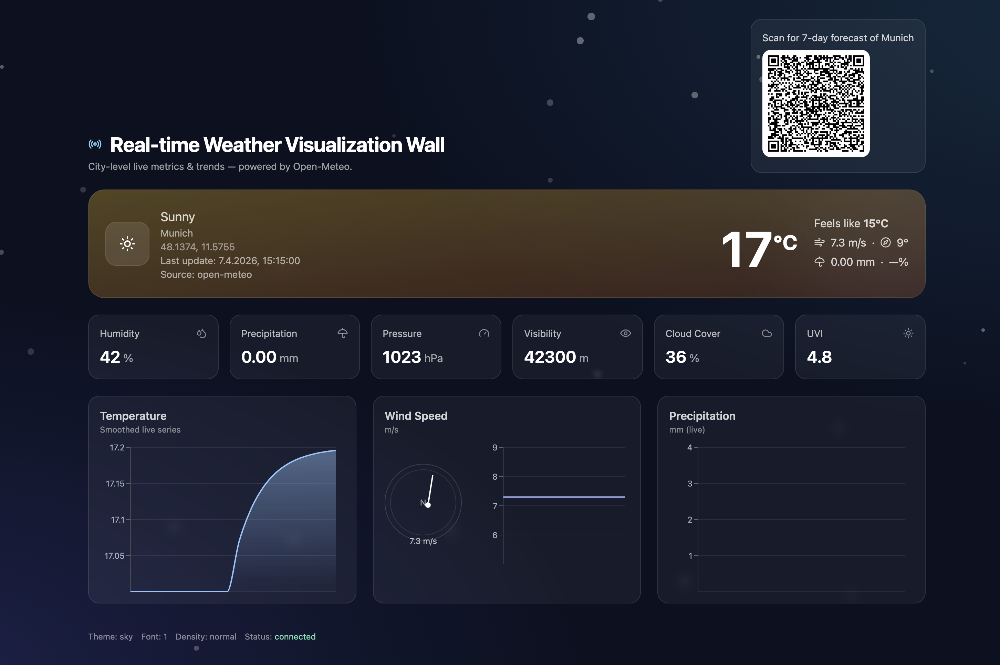
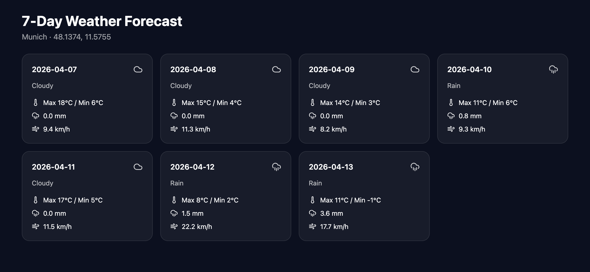
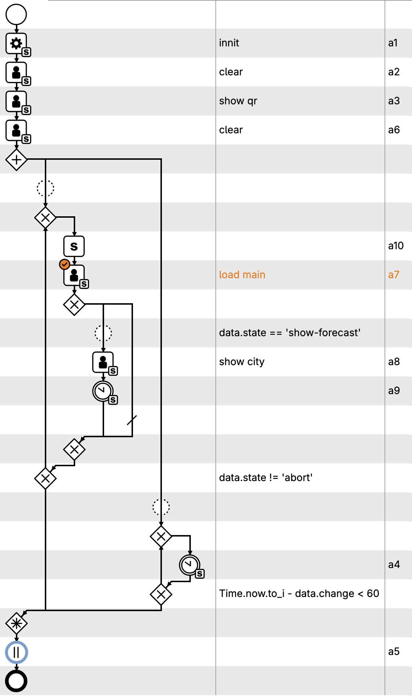

# 🌦️ Real-time Weather Visualization Wall

A real-time, interactive weather dashboard powered by **Open-Meteo**, enhanced with **QR-based interaction** and orchestrated via a **CPEE process flow**.

This project provides:
- 📊 Live weather visualization with continuously updated city-level weather metrics
- 📱 QR code interaction to trigger a temporary **7-day forecast view**
- ⚙️ Workflow orchestration using **[CPEE](https://cpee.org)**

---

## Overview

The **Real-time Weather Visualization Wall** is an interactive weather display built with **React** and **TypeScript**. The application has two pages:

1. **Main page**  
   Displays real-time weather data for a selected city, including key metrics and live charts.
   

2. **7-day forecast page**  
   Appears after the user scans the QR code shown on the main page. This page is displayed for a limited time, after which the workflow ends automatically.
   

The overall behavior is controlled by a **CPEE process**, which manages initialization, QR display, page switching, waiting logic, and the final timeout.

---

## Features

- Real-time weather visualization using **Open-Meteo**
- Dynamic city resolution from URL parameters or geocoding
- Smooth live data updates every 60 seconds
- Animated and responsive dashboard UI
- QR code generation for user interaction
- Separate 7-day forecast page
- Process-driven page transitions with **CPEE**

---

## ▶️ How to Use

The project is already built and deployed on the server:

👉 https://lehre.bpm.in.tum.de/~ge48tiy/weather/

You do **not** need to run the frontend locally.

---

### 1. Import the CPEE Process

- Open your **CPEE engine**
- Import the provided `cpee.xml` process file

You can also directly open the process via the CPEE Hub:

👉 https://cpee.org/hub/?stage=development&dir=Teaching.dir/Prak.dir/TUM-Prak-25-WS.dir/JinTianle.dir/

Then click:

**JoyPrak_Kevin.xml**

This will load the process without manual import.

---

### 2. Configure the Target City

Before running, you need to specify the city in the following tasks:

- **`load main`**
- **`show city`**

You can configure the location in two ways:

#### Option A: By city name

Specify the target city in the page parameters, e.g., city: Munich.

#### Option B: By longitude and latitude

Specify the target city in the page parameters, e.g., lat: 48.137, lon: 11.575.

### 3. (Optional) Customize UI Style

You can customize the appearance of the dashboard via **page parameters** in the **`load main`** task.

#### Available settings:

- `fontScale`: number (e.g., `0.85 – 1.3`)
- `accent`: `"sky" | "emerald" | "violet" | "rose"`
- `density`: `"compact" | "normal" | "comfortable"`

### 4. Start the cpee process

Start the cpee process.
Open https://cpee.org/out/frames/kevin/ to see the page.

## CPEE Process Summary

The workflow in the CPEE process is as follows:

## 🎬 Demo

You can watch a demo of the system here:

